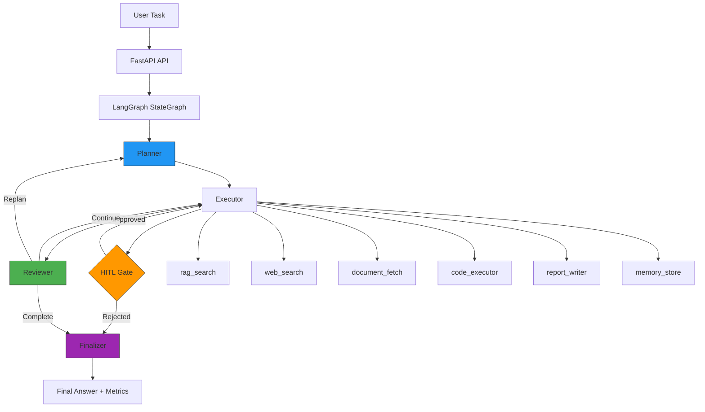

# RAG-Agent — AI Agent with Tool Use

Production-ready autonomous research agent built on **LangGraph**, **Anthropic Claude**, and **FastAPI**. Combines retrieval-augmented generation with multi-step reasoning, real tool execution, and human-in-the-loop controls.

> Part of a coherent portfolio arc: [RAG](https://github.com/lightskinhorti/RAG) → **Agent** → MLOps.
> The `rag_search` tool connects directly to the ChromaDB knowledge base from the RAG project, making both projects a unified system rather than isolated demos.

## Architecture



## Features

| Feature | Implementation |
|---------|---------------|
| **Stateful Agent** | LangGraph `StateGraph` with conditional edges and cycle support |
| **Persistent Checkpointing** | `SqliteSaver` — agent survives restarts, resumes from exact state |
| **Human-in-the-Loop** | `interrupt_before` mechanism — code execution requires human approval |
| **6 Real Tools** | Each with Pydantic schemas, retry logic (tenacity), structured logging |
| **Hybrid Search** | ChromaDB dense + BM25 sparse + Reciprocal Rank Fusion |
| **Multi-step Reasoning** | Plan → Execute → Review → Replan cycle with explicit reflections |
| **Observability** | Token usage, tool latencies, success rates per run |
| **Evaluation Framework** | 20 test cases across 5 categories with automated metrics |
| **REST API** | FastAPI with async execution, status polling, trace retrieval |
| **Docker Ready** | Multi-service docker-compose with health checks |

## Tools

| Tool | Description | HITL |
|------|-------------|------|
| `rag_search` | Hybrid semantic + keyword search over ChromaDB knowledge base | No |
| `web_search` | DuckDuckGo web search (no API key required) | No |
| `document_fetch` | Fetch and parse HTML pages and PDF documents | No |
| `code_executor` | Execute Python in RestrictedPython sandbox | **Yes** |
| `report_writer` | Generate structured Markdown reports with TOC | No |
| `memory_store` | Persistent SQLite key-value store for cross-session memory | No |

## Quick Start

### Docker (recommended)

```bash
git clone https://github.com/lightskinhorti/AI-Agent-With-Tool-Use.git
cd AI-Agent-With-Tool-Use
cp .env.example .env   # Add your ANTHROPIC_API_KEY
docker compose up --build
```

- **API**: http://localhost:8000/docs
- **UI**: http://localhost:8501

### Local Development

```bash
pip install -r requirements.txt
cp .env.example .env   # Add your ANTHROPIC_API_KEY

# Run the API
uvicorn api.main:app --reload

# Run the UI (separate terminal)
streamlit run ui/app.py

# Or use the CLI directly
python -m agent.run "What are the key principles of the EU AI Act and how do they affect tech companies?"
```

### Run Tests

```bash
pytest tests/ -v
```

### Run Evaluation

```bash
python -m evaluation.evaluate
```

## API Endpoints

| Method | Path | Description |
|--------|------|-------------|
| `POST` | `/agent/run` | Start an agent task (async) |
| `GET` | `/agent/status/{run_id}` | Poll execution status |
| `GET` | `/agent/result/{run_id}` | Get final answer + metrics |
| `GET` | `/agent/trace/{run_id}` | Full execution trace |
| `POST` | `/agent/approve/{run_id}` | Approve HITL-paused action |
| `POST` | `/agent/reject/{run_id}` | Reject HITL-paused action |
| `GET` | `/health` | Health check |

## Why This Architecture Is Hard

This is not a chatbot with tools. Here's what makes it production-grade:

**1. State persistence with SqliteSaver, not MemorySaver.**
95% of agent tutorials use `MemorySaver` — state lives in RAM and dies with the process. This agent uses `SqliteSaver`: every graph transition is checkpointed to disk. The agent can crash mid-execution, restart, and resume from the exact step where it stopped. That's what production means.

**2. Real HITL with `interrupt_before`, not a confirmation dialog.**
When the agent wants to execute code, the graph *actually suspends*. State is persisted. The process can die. Hours later, a human approves via API, and the graph resumes from the checkpoint with the approval injected into state. This is the mechanism enterprise systems use for compliance and safety — not a `input("Are you sure?")`.

**3. Multi-step reasoning with explicit reflection.**
The Reviewer node doesn't just check "did the tool return data." It evaluates whether the accumulated results are *sufficient* to answer the task, and can trigger replanning with a different strategy. The reflections are logged and visible in the trace — auditable reasoning, not a black box.

**4. Tool failures don't crash the agent.**
Each tool has retry logic with exponential backoff. If a tool fails after 3 retries, the agent records the failure, continues to the next step, and the Reviewer decides whether to work with partial results or try a different approach. Circuit breaker at 3 total errors prevents infinite loops.

## Tech Stack

- **Agent Framework**: LangGraph (StateGraph, checkpointing, interrupts)
- **LLM**: Anthropic Claude (via langchain-anthropic)
- **Vector Store**: ChromaDB (persistent, embedded)
- **Sparse Retrieval**: BM25 (rank-bm25)
- **API**: FastAPI + uvicorn
- **UI**: Streamlit
- **Logging**: structlog (structured JSON logging)
- **Retry Logic**: tenacity
- **Validation**: Pydantic v2
- **Code Sandbox**: RestrictedPython
- **Containerization**: Docker + Docker Compose

## Project Structure

```
├── agent/              # Core agent: state, graph, nodes, tools
│   ├── graph.py        # StateGraph with interrupt_before
│   ├── nodes.py        # planner, executor, reviewer, hitl_gate, finalizer
│   ├── state.py        # AgentState TypedDict with reducers
│   └── tools/          # 6 tools with base class pattern
├── api/                # FastAPI REST API
│   └── routes/         # Agent execution + HITL endpoints
├── ui/                 # Streamlit frontend
├── evaluation/         # 20 test cases + automated evaluation
├── tests/              # pytest unit + integration tests
├── docker-compose.yml  # Multi-service deployment
└── Dockerfile          # Multi-stage build
```

## Documentation

| Document | Description |
|----------|-------------|
| [**PDF Guide (16 pages)**](docs/RAG_Agent_Guide.pdf) | Complete architecture, API reference, design decisions, and example flows |
| [Architecture Guide](docs/architecture.md) | System architecture, agent flow, state management, error handling |
| [Usage Guide](docs/usage_guide.md) | Installation, configuration, CLI/API/UI usage, adding documents |
| [Example Output](examples/sample_output.md) | What a real agent execution looks like end-to-end |
| [Example Trace](examples/sample_trace.json) | Full execution trace JSON for a multi-tool task |

To regenerate the PDF:
```bash
python docs/generate_pdf.py
```

## Roadmap

- [ ] **MCP Integration** — Expose tools via Model Context Protocol for interoperability
- [ ] **Parallel Tool Execution** — Execute independent tool calls concurrently
- [ ] **LangSmith Tracing** — Production observability with LangSmith
- [ ] **Streaming Responses** — SSE/WebSocket for real-time UI updates
- [ ] **Multi-agent Collaboration** — Specialized sub-agents for complex tasks

## License

MIT
